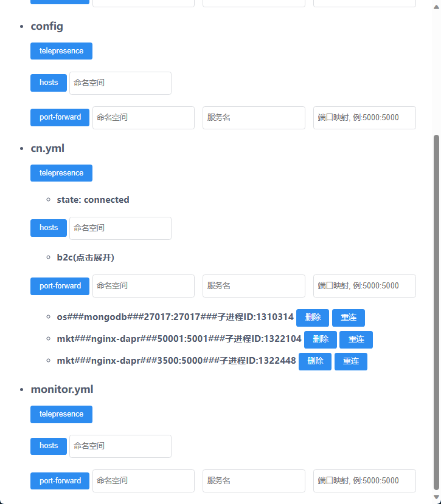

# 功能
1. 一键添加hosts
2. kubectl port-forward保活重连
3. telepresence保活重连
## 

# 安装依赖
```sh
pip install -r requirements.txt -i https://pypi.tuna.tsinghua.edu.cn/simple
```

# 运行方式(三选一即可)

1. 直接运行: flask run --port=12345

2. 后台运行: nohup flask run --port=12345 &

3. systemd运行(支持开机自动重启):
- 修改k8stools.service的WorkingDirectory和ExecStart
- 把k8stools.service复制到/etc/systemd/system
- 执行sudo systemctl daemon-reload
- 执行sudo systemctl enable k8stools.service
- systemctl操作
```sh
    # 启动
    sudo systemctl start k8stools.service
    # 重启
    sudo systemctl restart k8stools.service
    # 停止
    sudo systemctl stop k8stools.service
```

# 初始化设置
- 打开http://127.0.0.1:12345
- 配置.kube路径和sudo密码, 如: /home/hushuikun/.kube  hsk123456
- 配置kubectl和telepresence路径
